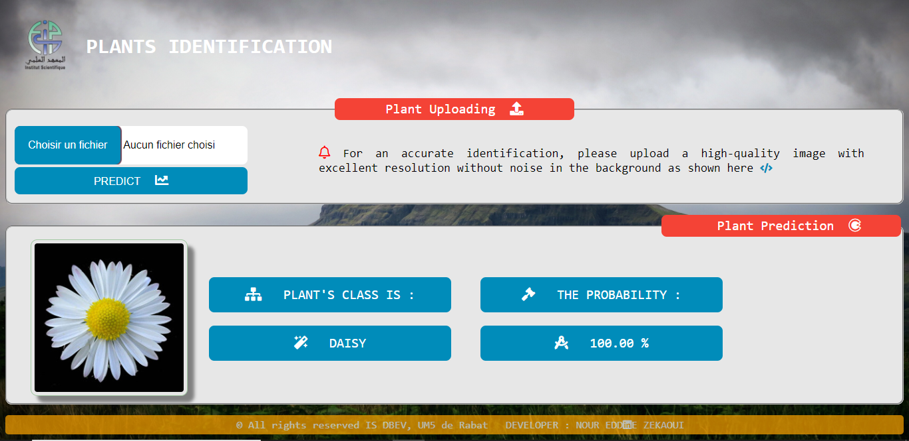

# Plants Identification DL Model Deployment using Django framework
Plants Identification By Deep Learning : Model deployment using Django framwork in python (A Simple Web App)

---
## Table of contents
- [Introduction](#introduction)
- [Technologies](#technologies)
- [How To Use](#how-to-use)
- [Few Take Aways](#few-take-aways)
- [Conclusion](#conclusion)
- [Author Infos](#author-info)

---
### Introduction
Data science is too cool to be left in a notebook. We need some way to make models useful for, let’s say, web applications, but how can we do so? Today we’ll deploy our machine learning model already trained with Django in python, and then make predictions with Python’s requests library. So, Continuing from my last post on [Plants Identification by Deep Learning](https://github.com/zekaouinoureddine/Plants_Identification_DL_SI) Project where we built and trained full CNN architecture using keras with a tensorflow backend from scratch which is the major tasks of building a robust DL model, this post offers a simple and fast solution to deploying our DL model on the web. however, **Flask** is also used on a large scale, but we will leave it for another occasion.
This is the last task of the DL plant identification project that we will explain here. So, Put on your seat belts, the race begins now!

---
### Technologies
**What do we need to deploy?**
- **A trained model ready to deploy:** If you've took a look on Plants Identification, you can see that we Saved our model in a **.h5** file using **ModelCheckpoint** callback methode as shown bellow
```python
# Importing the ModelCheckpoint callback methode
from keras.callbacks import ModelCheckpoint
checkpointer = ModelCheckpoint(filepath = "/gdrive/My Drive/PId_Best.h5", save_best_only = True, verbose = 1)
```
The model saved in the **PId_Best.h5** file will be further loaded and used by the web service. You can take a look [here](https://github.com/zekaouinoureddine/Plants_Identification_DL_SI/blob/main/Plants%20Idenification%20VF.ipynb) for the entire code.
- **A web service:** That gives a purpose for our model to be used in practice. For our plants identification model, it can be using the plant image to predict its type or class. We’ll use Django to develop this service.
So as a summary, We will use the **django** framework in **python** with the following libraries (**Keras, Tensorflow, Pandas, and Numpy**). All this will be implemented using **visual studio editor**

---
### How To Use
**Installation**

We’ll assume you have [Django installed](https://docs.djangoproject.com/en/3.0/intro/install/) already. You can tell Django is installed and which version by running the following command in a shell prompt (indicated by the $ prefix):
    
    $ python -m django --version
 
**Creating a django project**

From the command line, cd into a directory where we’d like to store our code, then run the following command:
    
    $ django-admin startproject rab

This will create a rab directory in the current directory
Let’s look at what **startproject** created:

    rab/
    manage.py
    mysite/
       __init__.py
       settings.py
       urls.py
       asgi.py
       wsgi.py
       
**The development server**

Let’s verify our Django project works. Change into the outer **rab** directory, if you haven’t already, and run the following commands:

    $ python manage.py runserver
We’ll see the following output on the command line:

    Performing system checks...
    System check identified no issues (0 silenced).
    You have unapplied migrations; your app may not work properly until they are applied.
    Run 'python manage.py migrate' to apply them.
    octobre 01, 2020 - 15:50:53
    Django version 3.1, using settings 'rab.settings'
    Starting development server at http://127.0.0.1:8000/
    Quit the server with CONTROL-C.
Now that the server’s running, visit http://127.0.0.1:8000/ with our Web browser. Wou’ll see a “Congratulations!” page, with a rocket taking off. It worked!

**Creating the FloraRec app**

To create your app, make sure you’re in the same directory as manage.py and type this command:
    
    $ python manage.py startapp FloraRec
That’ll create a directory **FloraRec**, which is laid out like this:

    FloraRec/
        __init__.py
        admin.py
        apps.py
        migrations/
            __init__.py
        models.py
        tests.py
        views.py
This directory structure will house the PloraRec application.

Afer all great things we've been doing, it's time to do the hard things. Dont worry there are not hard ! 
first we need to update the content of the [_.rab/FloraRec/**Views.py**_](https://github.com/zekaouinoureddine/Plants_Identification_DL_Model_Deployment_Django/blob/main/views.py) file, where the script bellow shows how we loaded our model saved before (PId_Best.h5 which have to be put it in the **.rab/** folder (.rab/PId_Best.h5)) and how will be trating requets coming from our **index.html** 
```python
from django.shortcuts import render 
from django.core.files.storage import FileSystemStorage 
from keras.models import load_model 
from keras.preprocessing import image 
from keras.preprocessing.image import img_to_array, load_img 
from django.conf.urls import url 

model = load_model('PId_Best.h5') 
labels = ['daisy','dandelion','rose', 'sunflower', 'tulip'] 
img_heigh, img_with = 150, 150 

""" ... 
    def index(): 
    You can download the entire code from this repository
    ...
""" 

def predImg(request):
    if request.method == 'POST': 
        context = {} 
        uploaded_file= request.FILES['img'] 
        fs = FileSystemStorage() 
        name = fs.save(uploaded_file.name, uploaded_file) 
        context["url"] = fs.url(name) 
        print(context["url"]) 
        testimage = '.'+context["url"] 
        img = image.load_img(testimage, target_size=(img_heigh, img_with)) 
        
        x = image.img_to_array(img) 
        x = x/255 
        x = x.reshape(1, img_heigh, img_with, 3) 
        pred = model.predict(x) 
        
        import numpy as np 
        context['predictedClass'] = labels[np.argmax(pred[0])] 
        context['probability'] = "{:.2f}".format(round(np.max(pred), 2)*100)
        
    return render(request,'index.html',context)
```
Make sure you've created another file called [.rab/FloraRec/**urles.py**](https://github.com/zekaouinoureddine/Plants_Identification_DL_Model_Deployment_Django/blob/main/FloraRec/urls.py), then put the following content in it:
```python
from django.urls import path 
from . import views 
urlpatterns = [ path('',views.index, name='index'), 
path('predImg',views.predImg, name='predImg') ]
```
In the [.rab/urles.py](https://github.com/zekaouinoureddine/Plants_Identification_DL_Model_Deployment_Django/blob/main/urls.py), then copy the following content in it:
```python
from django.contrib import admin 
from django.urls import path, include 
from django.conf import settings 
from django.conf.urls.static import static 
urlpatterns = [ path('', include('FloraRec.urls')), 
                path('admin/', admin.site.urls) ] 

if settings.DEBUG: urlpatterns += static(settings.MEDIA_URL, document_root=settings.MEDIA_ROOT)
```
Creat a templates folder, the creat a file called [.rab/templates/index.html](https://github.com/zekaouinoureddine/Plants_Identification_DL_Model_Deployment_Django/blob/main/templates/index.html) in it. then creat the [.rab/static/**images**](https://github.com/zekaouinoureddine/Plants_Identification_DL_Model_Deployment_Django/tree/main/static/images) folder and put the two images [examp.png](https://github.com/zekaouinoureddine/Plants_Identification_DL_Model_Deployment_Django/blob/main/static/images/examp.jpg) and [logo.png](https://github.com/zekaouinoureddine/Plants_Identification_DL_Model_Deployment_Django/blob/main/static/images/logo.png) in it. Great ! But do not forget to update thr content of [.rab/static/styles/styles.css](https://github.com/zekaouinoureddine/Plants_Identification_DL_Model_Deployment_Django/blob/main/static/styles/styles.css) file, dont worry all contents are available above you just need to copy or download them.

At this level, we have to make some changes on the [.rab/settings.py](https://github.com/zekaouinoureddine/Plants_Identification_DL_Model_Deployment_Django/blob/main/settings.py) file which are generally as follows :
```python
from pathlib import Path import os
TEMPLATES = [ 
       { 
       """ ... 
       Here we are gonna make modifs on the 'DIRS' ‘s value 
       """ 
       'DIRS': [os.path.join(BASE_DIR,'templates')], 
       #... },
       ]
       
       # At the end we added
       STATIC_URL = '/static/' 
       STATICFILES_DIRS = [ os.path.join(BASE_DIR, 'static') ] 
       
       # Base url to serve media files 
       MEDIA_URL = '/media/'
```
After re-typing the following command: 

    $python manage.py runserever
You will be able to see our amazing web app interface showen below:    
    


Congratulations ! We did it .
---
### Conclusion

---
### References
- [Plants Identification by Deep Learning](https://github.com/zekaouinoureddine/Plants_Identification_DL_SI)
- [Writing your first Django app, part 1](https://docs.djangoproject.com/en/3.0/intro/tutorial01/) - django documentation
- Ref 3
---
### Author Infos
- LinkedIn: [Nour Eddine ZEKAOUI](https://www.linkedin.com/in/nour-eddine-zekaoui-ba43b1177/)
- Twitter: [@NZekaoui](https://twitter.com/NZekaoui)

---

#### Thank you for your intrest ☻

[Back To The Top](#plantes-identification-dl-model-deployment-using-django-framework)
